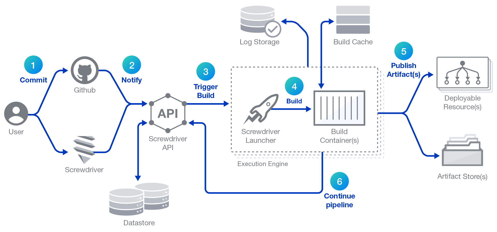
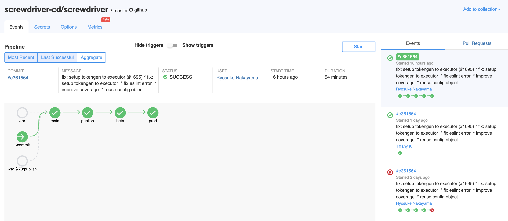

# CD Foundation Proposal for Screwdriver

## Name of project
Screwdriver

## Summary
### Proposal
We seek [Screwdriver](https://screwdriver.cd) to be accepted as an incubation project with the Continuous Delivery Foundation. The CD Foundation is becoming the neutral home for open source CI/CD technology. Screwdriver is a mature CI/CD platform that is completely open source and seeks to develop our community and adoption under the guidance of our peers in the foundation.

### Rationale
Screwdriver operates at scale and in production at Verizon Media and Yahoo Japan.  We’d like to grow the community and incorporate more thought leadership from the CD Foundation to help guide the development of this platform so that it continues to track industry trends in the CI/CD space.

### Project description
Screwdriver is an open source CI/CD platform that orchestrates and implements the build and release workflow for complex software projects. [Our recent presentation to the CD Foundation](https://docs.google.com/presentation/d/1LNv-VlI0g9pcSra18sEmrLJ1lw-O2V5wpBfG9YV-Ink/edit#slide=id.g5ce0c2ee90_0_200) highlights Screwdriver’s architecture, features, capabilities, and community. Users can implement our screwdriver-in-a-box solution using Docker Compose or a Kubernetes Helm chart for deploying the entire Screwdriver ecosystem into their environment. 

Screwdriver was built with extensibility in mind. It supports multiple plugins: 
- Source Code Management (GitHub, GitLab, Bitbucket)
- Executors (Kubernetes, Docker, Jenkins, AWS EC2)
- Databases (Postgres, MySQL, MariaDB, SQLite)
- Microservices/Bookends (artifact, build, cache, coverage)

In cases where a desired plugin is not available, users can create their own and contribute back to the project. This flexibility makes Screwdriver suitable for many different types of applications, including web, mobile, services, and grid.

Screwdriver supports the Kubernetes cloud, and it has built-in secret management, pipeline and user-scoped tokens, and VM-based builds using Hyper container. We achieve scalability by allowing users to set up Screwdriver with multiple build clusters. Screwdriver admins can provide a native hot/hot HA solution with multiple clusters on standby. This also opens up the possibility for teams to bring their own clusters into Screwdriver, allowing them to run their builds in their own infrastructure. 

Screwdriver also achieves scalability by supporting advanced build cache features, allowing the builds to run faster. Our build metrics user interface enables users to visualize the build performance trends over time. Screwdriver also supports advanced workflow features such as native support for mono-repos, feature branch builds, remote triggers, and easy rollback.

Screwdriver Architecture Diagram

Screwdriver Pipeline Example

## Origin and History
Historically, development teams at Yahoo managed their own build, test, and release pipelines. Each team operated separately, working to find their own solutions to meet the demands of the company’s high standards and rapid pace. Most of the teams were relying on adhoc release processes. We needed a CI/CD solution that would scale to our volume.

[Screwdriver](https://screwdriver.cd) was designed and built ground up with the scale, security, and workflow needs of developers in mind. We open sourced Screwdriver in 2016 and continue to evolve the project using the greatest technologies and best CI/CD practices. 

## Statement on alignment with foundation charter's mission

The CD Foundation’s mission articulates four values: The value of continuous delivery to manage development operations; open source to encourage open development; fostering a vendor neutral ecosystem; and collaboration among practitioners. The Screwdriver team and community shares these values. 

We developed Screwdriver under the mantra “no humans involved.” We invested many person-years to create an automation platform that supports reproducibility, reliability, and quality of software projects. We believe in automation and are committed to reducing manual interaction with the testing and deployment process. We designed our solution to be open source and vendor neutral. Screwdriver is not tied to any proprietary tools for deployment. We use popular open source container and deployment technologies such as Kubernetes and Docker. We demonstrate our commitment to collaboration by working with peers at Yahoo Japan, and by proposing to join this foundation to help further expand our collaboration. 

## Link to *current* Code of Conduct (if one is adopted already)
https://github.com/screwdriver-cd/screwdriver/blob/master/code-of-conduct.md

## Sponsor from TOC, if identified (a sponsor helps mentor projects)
N/A

## Project license 
BSD-3-Clause

## Source control (GitHub by default)
https://github.com/screwdriver-cd

## Issue tracker (GitHub by default)
https://github.com/screwdriver-cd/screwdriver/issues

## External dependencies (including licenses)
https://docs.screwdriver.cd/cluster-management/dependencies

## Release methodology and mechanics
* Using semantic release package to handle versioning - 
https://github.com/semantic-release/semantic-release
* Publish Docker containers for UI, API, Store, etc - 
https://cloud.docker.com/u/screwdrivercd/repository/list
* Explanation of major features found in Docker image versions is explained in blog posts - 
https://blog.screwdriver.cd; we Docker tag blog-published versions with “stable” and the newest with “latest”
* Blog posts are announced on Slack (#general channel) - 
https://screwdriver-cd.slack.com

## Names of initial committers, if different from those submitting proposal
Original main contributors not on proposal: [St. John Johnson](https://github.com/stjohnjohnson), [Jeremiah Wuenschel](https://github.com/jer), [Noah Katzman](https://github.com/nkatzman), [Peter Peterson](https://github.com/petey), and [Darren Matsumoto](https://github.com/FenrirUnbound)
Current team: [Dao Lam](https://github.com/d2lam),[Dekus Lam](https://github.com/DekusDenial), [Jithin Emmanuel](https://github.com/jithin1987),[ Min Zhang](https://github.com/minz1027), [Tiffany Kyi](https://github.com/tkyi), [Lakshminarasimhan Parthasarathy](https://github.com/parthasl), [Alan Dong](https://github.com/adong) and [Venu Narayanabhatla](https://github.com/vnugopal)
Also partners from Yahoo Japan: [Ryosuke Nakayama](https://github.com/catto), [Keisuke Kumada](https://github.com/kumada626), [Yoshika Shota](https://github.com/s-yoshika), [Teppei Minegishi](https://github.com/sakka2), [Hiroki Takatsuka](https://github.com/tk3fftk), [Kenta Kawaharada](https://github.com/wahapo),[ Yomei Komiya](https://github.com/wdstar), [Yuya Takahashi](https://github.com/y-takaha5hi), [Yuta Ohkawara](https://github.com/yokawara), [Yoshiyuki Watanabe](https://github.com/yoshwata), [Yuichi Sawada](https://github.com/yuichi10), [Kazuki](https://github.com/kkokufud)

Briefly describe the project's leadership team and decision-making process
Jithin Emmanuel is the Screwdriver product owner at Verizon Media and is responsible for leading the primary development effort. He has a team of six engineers that form the core contributor community for the project. 

Major design decisions are discussed and documented in the primary repository’s design directory, and community priorities are established via the project’s GitHub Kanban board. Priorities are determined based on the requirements of the two primary companies that are involved in development work and we have biweekly meetings to sync priorities between community participants. These meetings can be opened up to the public for more transparency and collaboration.

## Link to any documented governance practices
Contributing docs - https://docs.screwdriver.cd/about/contributing/index

## Preferred maturity level (see stages below)
Incubation

## List of project's official communication channels (slack, irc, mailing lists)
* Slack: https://screwdriver-cd.slack.com
* Stack Overflow: https://stackoverflow.com/questions/tagged/screwdriver-cd

## Link to project's website 
* Homepage - https://screwdriver.cd
* Documentation - https://docs.screwdriver.cd

## Links to social media accounts
* Tumblr: https://blog.screwdriver.cd
* Twitter: https://twitter.com/screwdrivercd
* Meetup: https://www.meetup.com/Bay-Area-CICD-and-DevOps-Meetup

## Existing financial sponsorship
Project infrastructure is sponsored by Verizon Media. The core committers are Verizon Media and Yahoo Japan employees.

## Infrastructure needs or requests
We want to be associated with and have a presence in CD foundation events that enable developers around the world to leverage, contribute, and take advantage of our open source offering. We would also like to have the foundation assist with setting up a truly open Screwdriver instance for everyone to experiment and contribute to it.
